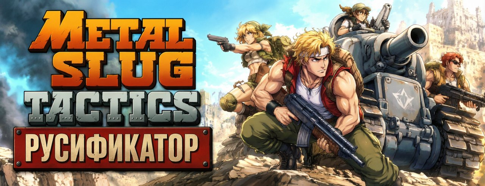
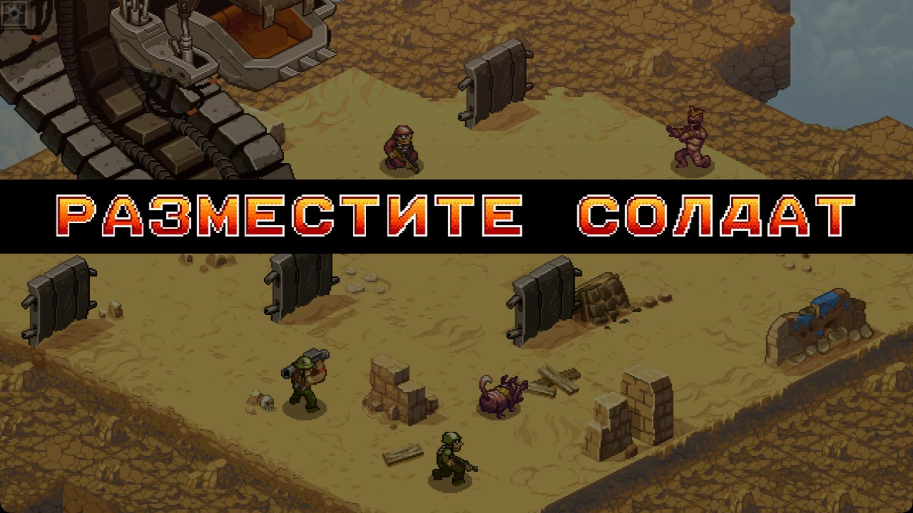

<p align="center"></p>

[Русский](README.md) · **English**

# Metal Slug Tactics — Russian translation

A full Russian translation of Metal Slug Tactics — the entire game, including the campaign
dialogue. It works as a native locale: the language is added right into the game and switched in the settings.

<p align="center"></p>

## Download

Download **`mst-ru-setup.exe`** from the [releases](../../releases/latest) page and run it.

If Windows SmartScreen shows “unknown publisher”, click **“More info” → “Run anyway”**.

## License

An unofficial, non-commercial fan translation, not affiliated with the rights holders. The game and
its assets belong to SNK, Dotemu and Leikir Studio; the translation is built on your machine from
your own copy of the game and is not distributed. Code and translation sources are under [MIT](LICENSE).

---

## Development

Below is how the translation works inside and how to edit it. A regular player does not need this.

### How it works

#### Text

The game has its own localization system (Unity Localization) with nine languages; Russian is
not among them, and a tenth cannot be added. So Russian took over the slot of **Brazilian
Portuguese** — a language you almost certainly do not need. English and all the rest are left
untouched: in the `НАСТРОЙКИ → Язык` menu a «Русский» item appears, and you can switch between
it and English.

The key thing that made the swap possible: the Addressables catalog **stores no bundle
checksums**, so the string table can be rebuilt and the game will not notice.

Three non-obvious facts, learned the hard way:

- `Save/Options` → `Locale.option` takes the **locale's asset name**, not a code:
  `"Portuguese (Brazil) (pt-BR)"`, not `"pt-BR"`. With a code the game silently ignores the setting.
- The language name in the list is taken from the `UI/240000458967474176` string inside **the
  table itself** (in the English one it is `English`), not from the locale object's `m_LocaleName`
  field — the game does not read that.
- The `UI/167188675005767680` string = `{Platform.IsConsole:{Locale}|System ({Locale})}` labels
  the system-language item. In the Russian table it is replaced with `{Locale}`, otherwise the
  item is called «Системный (Русский)».

#### Banner captions

The big captions on the black bar — `ХОД ИГРОКА`, `ХОД ПРОТИВНИКА`, `РАЗМЕСТИТЕ БОЙЦОВ`,
`ПОБЕДА`, `ПОРАЖЕНИЕ` — are drawn **not as text but as sprites**: the `SpriteText` component
splits a string into characters and pulls a separate 25×25 image for each one from the
`SpriteFont` table. There were no Cyrillic codes there — hence an empty black bar instead of a
caption. Editing the TextMeshPro fonts is useless here in principle.

Only five captions are drawn with sprites, and English needs only the letters
`A C D E F I L M N O P R S T U V Y` in them. That means `G J Q W Z !` and the digits sit in the
set as dead weight — their pixels are the ones repainted for Cyrillic. English stays fully intact.

- **12 letters** (`А В Е К М Н О Р С Т Х`, and also `З` → the digit `3`) **reference Latin sprites** —
  the shapes coincide, not a single pixel is touched.
- **8 letters** (`Б Г Д Ж И Й П Ц`) are redrawn from scratch. `И` is a mirrored `N`, reflected pixel for pixel.

The letter recipe is reverse-engineered from the originals and reproduces `H`, `T`, `E`, `F` **pixel for pixel**:

- fill — five gradient bands of two rows each: `(248,208,48) → (248,144,24) → (248,104,0) → (240,48,0) → (176,0,0)`;
- between the bands — **dithering**: two rows of a checkerboard, dark colour when `(row + column)` is even;
- shadow `(120,0,0)` — along the **top and left** edge of the fill, not a ring;
- white outline `(248,248,248)` — 1px outward;
- black border — a ring around the outline **plus** a drop shadow offset down-right.

### Editing the translation

1. Open `translation/ru.json` — a flat dictionary `"string id": "Russian text"`.
2. Edit the text. **Do not touch** the paths inside `{...}` or the tags `<...>` — the output will
   break. But the text AFTER the colon inside a placeholder (`{Move:перемещает}`) is exactly what the
   player sees, so it can and should be edited.
3. `install.bat` (or `./install.sh`) checks the markup integrity, rebuilds and installs.
   Add `--dry-run` to only check.

### Editing the letters

The shapes live in `font/` as plain text: `#` is ink, `.` is empty.
Edit the grid — the installer rebuilds. The outline, shadow, border and the gradient with
dithering are added automatically by the recipe.

### Term decisions

- Peregrine Falcons / Falcons → **«Сапсаны»** · SPARROWS → **«Воробьи»**
- unit → **боец** · Sync → **синхроудар** · World Government → **Всемирное правительство**
- `HP`, `DMG`, `ADR`, `XP`, `Init` stay in Latin — these are labels in cramped UI spots.
- `WASD` stays `WASD` (the old fan translation had «Ц/Ф/Ы/В» — the keys are physically the same, after all).

Details are in `glossary/`.

### From source (needs Python 3)

```sh
install.bat          # Windows
./install.sh         # Linux / macOS
```

The wrapper sets up a virtual environment, installs the dependencies, builds and installs the
translation. The game path is found automatically (Steam libraries + Wine prefixes); if not, set
`MST_PATH=...`. Roll back with `--revert`.

### Building the installer (for maintainers)

```sh
pip install UnityPy numpy Pillow pyinstaller
python packaging/make_icon.py            # only after changing the poster in packaging/art/
pyinstaller packaging/mst-ru.spec        # -> dist/mst-ru-setup.exe (single file)
```

PyInstaller bundles everything into a single `mst-ru-setup.exe` (onefile: on launch it unpacks to a
temp folder, patches the game, and cleans up). CI (`.github/workflows/build-installers.yml`) builds
it on a Windows runner on every **push to `main`** and keeps one rolling `latest` release, named with the build date.
